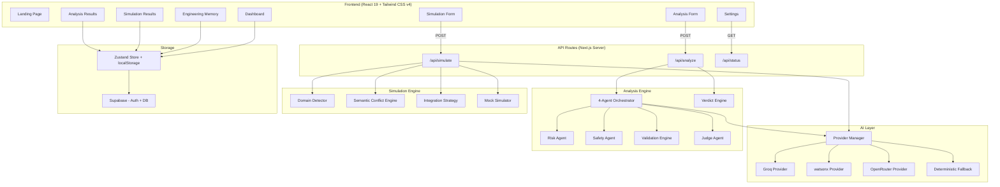
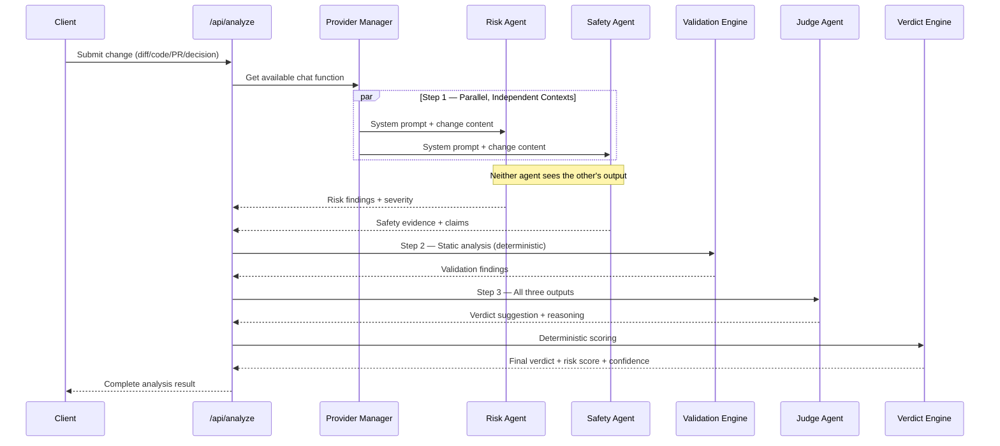
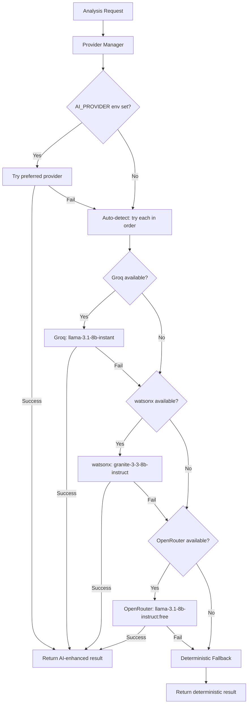
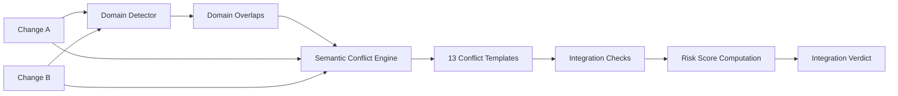

# VERDICT — Architecture

> Technical architecture documentation based on the actual codebase implementation.

---

## System Overview

VERDICT is a Next.js 16 full-stack application with a React 19 frontend, server-side API routes, and a multi-provider AI integration layer. All analysis logic runs server-side. The frontend renders results and manages client-side state.



---

## 4-Agent Adversarial Pipeline

The core analysis pipeline uses four agents executed in a specific order:



**Key design decisions:**
- Risk and Safety agents run with **completely independent contexts** — neither sees the other's output. This prevents anchoring bias.
- The Validation Engine is **deterministic** — pattern-based static analysis with no AI, no fabricated results.
- The Judge agent **explains** the verdict but does **not override** the deterministic scoring engine.
- The scoring algorithm in `verdict-engine.ts` is always the source of truth for verdict thresholds.
- Each AI call includes retry logic (up to 3 attempts with exponential backoff).

---

## AI Provider Chain



**Provider availability** is determined by env var checks — no network calls:
- **Groq**: available if `GROQ_API_KEY` is set
- **watsonx**: available if both `WATSONX_API_KEY` and `WATSONX_PROJECT_ID` are set
- **OpenRouter**: available if `OPENROUTER_API_KEY` is set
- **Fallback**: always available

Current configuration: `[groqProvider, watsonxProvider, openrouterProvider]` — Groq is the primary active provider.

---

## Semantic Conflict Engine

The merge simulation pipeline:



**13 Conflict Templates** across these domains:

| Domain | Templates | Example |
|---|---|---|
| Authentication | 2 | Auth mechanism incompatibility, token format break |
| Payment Processing | 2 | Duplicate transaction risk, webhook race condition |
| Database | 2 | Column rename break, concurrent migration safety |
| API Contracts | 2 | Response field renamed, endpoint path change |
| Async Processing | 1 | Sync → async assumption conflict |
| Configuration | 1 | Timeout reduction vs. slower dependency |
| Caching | 1 | Cache key namespace collision |

**Conflict detection logic:**
1. Domain detector identifies domains for each change based on keyword analysis
2. Domain overlap detection finds shared domains between the two changes
3. Each template checks for trigger keywords on both sides (bidirectional matching)
4. Matched templates produce typed conflicts with assumptions, consequences, and resolutions
5. Integration risk score is computed from conflict severity weights
6. Confidence is derived from content length and conflict count

---

## Application Routes

| Route | Purpose | Key Component |
|---|---|---|
| `/` | Landing page | `LandingHero`, `LandingNav` |
| `/dashboard` | Engineering intelligence dashboard | Metric cards, activity timeline, recent analyses |
| `/analyze` | Change analysis input form | Change type selector (Code/Diff/PR/Decision), demo scenarios |
| `/analyze/[id]` | Analysis pipeline + results | Live pipeline visualization, VerdictCard, finding cards |
| `/simulations` | Merge simulation input | Two-panel layout (Change A / Change B) |
| `/simulations/[id]` | Simulation results | IntegrationVerdictCard, conflict cards, integration checks |
| `/analyses` | Analysis history | List of all completed analyses with verdict badges |
| `/memory` | Engineering Memory | Searchable knowledge base, memory insights |
| `/settings` | AI provider status | Provider health checks, configuration |
| `/auth/*` | Authentication | Supabase auth flows |

## API Routes

| Endpoint | Method | Purpose |
|---|---|---|
| `/api/analyze` | POST | Runs the 4-agent analysis pipeline |
| `/api/simulate` | POST | Runs the merge simulation engine |
| `/api/status` | GET | Provider health check |
| `/api/groq-test` | GET | Groq provider connectivity test |

---

## State Management

- **Zustand** store (`analysis-store.ts`) manages analysis results, simulation results, and Engineering Memory
- Data persists in **localStorage** and survives page refresh
- **Supabase** provides authentication (sign up, sign in, OAuth) and database storage via Row Level Security
- The `demo-store.ts` manages Demo Mode activation state (K+P shortcut)

---

## Project Structure

```
src/
├── app/                          # Next.js App Router pages
│   ├── page.tsx                  # Landing page
│   ├── layout.tsx                # Root layout with sidebar
│   ├── globals.css               # Global styles + Tailwind config
│   ├── dashboard/                # Dashboard page
│   ├── analyze/                  # Analysis input + results
│   ├── simulations/              # Simulation input + results
│   ├── analyses/                 # Analysis history
│   ├── memory/                   # Engineering Memory
│   ├── settings/                 # Provider settings
│   ├── auth/                     # Authentication
│   ├── docs/                     # Documentation pages
│   └── api/                      # Server-side API routes
│       ├── analyze/route.ts      # 4-agent analysis endpoint
│       ├── simulate/route.ts     # Merge simulation endpoint
│       ├── status/route.ts       # Provider health check
│       └── groq-test/route.ts    # Groq connectivity test
│
├── lib/
│   ├── ai/
│   │   ├── agents/               # 4-agent pipeline
│   │   │   ├── orchestrator.ts   # Parallel execution coordinator
│   │   │   ├── risk-agent.ts     # Risk Intelligence agent
│   │   │   ├── safety-agent.ts   # Safety Validation agent
│   │   │   ├── judge-agent.ts    # Decision Engine (Judge)
│   │   │   └── validation-engine.ts  # Static analysis
│   │   ├── provider-manager.ts   # Auto-selection + fallback chain
│   │   ├── groq-provider.ts      # Groq free-tier provider
│   │   ├── watsonx-provider.ts   # IBM watsonx provider
│   │   ├── openrouter-provider.ts # OpenRouter provider
│   │   ├── prompts.ts            # Analysis + simulation prompts
│   │   ├── normalizer.ts         # Response normalization
│   │   ├── validator.ts          # Response validation
│   │   └── types.ts              # AI type definitions
│   ├── analysis/
│   │   ├── verdict-engine.ts     # Deterministic scoring + verdicts
│   │   ├── mock-analyzer.ts      # Pattern-based analysis engine
│   │   ├── nanoid.ts             # ID generation
│   │   └── types.ts              # Analysis type definitions
│   ├── simulation/
│   │   ├── semantic-conflict-engine.ts  # 13 conflict templates
│   │   ├── domain-detector.ts    # Domain identification
│   │   ├── integration-strategy.ts # Integration recommendations
│   │   ├── mock-simulator.ts     # Simulation orchestrator
│   │   └── types.ts              # Simulation type definitions
│   ├── demo-scenarios/           # Built-in demo data
│   ├── auth/                     # Authentication utilities
│   └── supabase/                 # Supabase client configuration
│
├── components/
│   ├── analysis/                 # VerdictCard, FindingCards, Pipeline
│   ├── simulation/               # IntegrationVerdictCard, ConflictCards
│   ├── dashboard/                # Dashboard widgets
│   ├── landing/                  # Landing page sections
│   ├── layout/                   # AppShell, AppSidebar
│   ├── intelligence/             # Intelligence components
│   ├── demo/                     # Demo mode components
│   ├── auth/                     # Auth UI components
│   └── ui/                       # Primitive UI components
│
├── store/
│   ├── analysis-store.ts         # Zustand store for analyses + memory
│   └── demo-store.ts             # Demo mode state
│
├── hooks/                        # React hooks
└── types/                        # Shared TypeScript types
```
